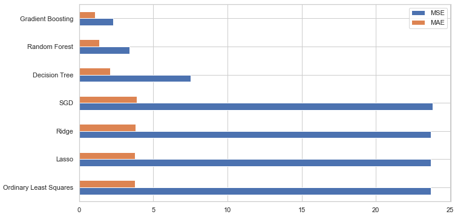
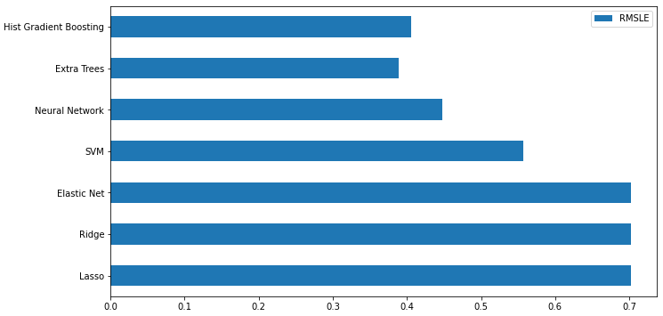

# Machine Learning Mini Projects
My projects for the MSc course 'Machine learning'.

### 1. CIFAR-100 (classification using TensorFlow 2)

### 2. Airfoil Self-Noise Prediction (regression using scikit-learn)

### 3. Seoul Bike Sharing Demand Prediction (regression using scikit-learn)

